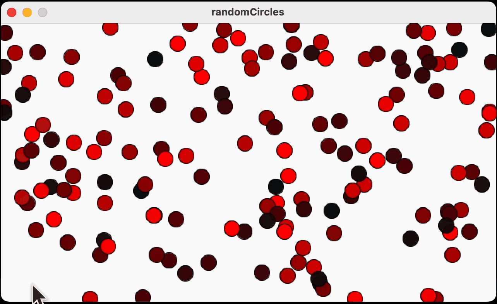
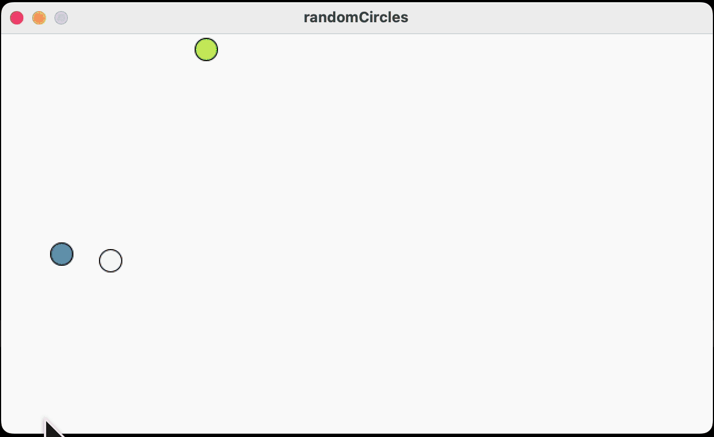
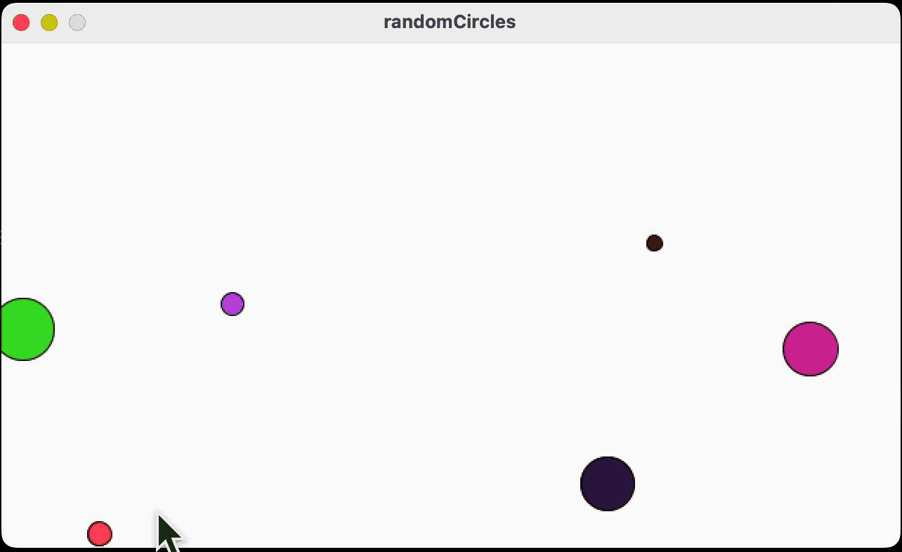
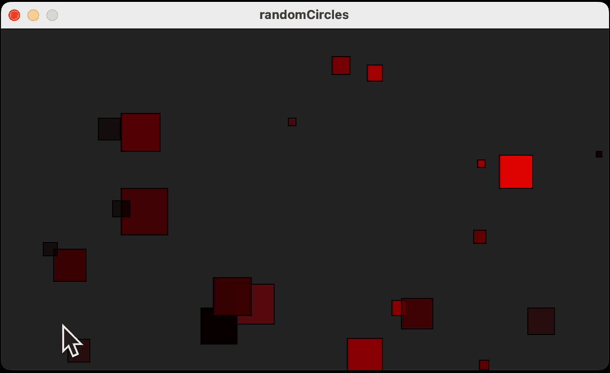

## random circles

en estos ejercicios se aplican los conceptos de la función `random`el cual nos devuelve un número al azar según el rango que le demos

```
random(0, 250) // de 0 hasta 250
random(250) // de 0 hasta de 250 es lo mismo que lo anterior
random(10, 50) // de 10 hasta 50
```

lo podemos aplicar a varios aspectos, desde obtener valores para posicionar nuestros elementos, colores, etc

## aparecen círculos de color rojo



## aparecen círculos de varios colores



## aparecen círculos de varios colores y tamanios



## aparecen cuadrados en tonalidades rojas de diferentes tamanios


